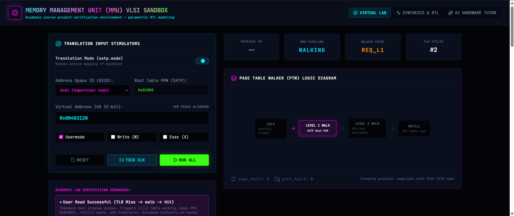
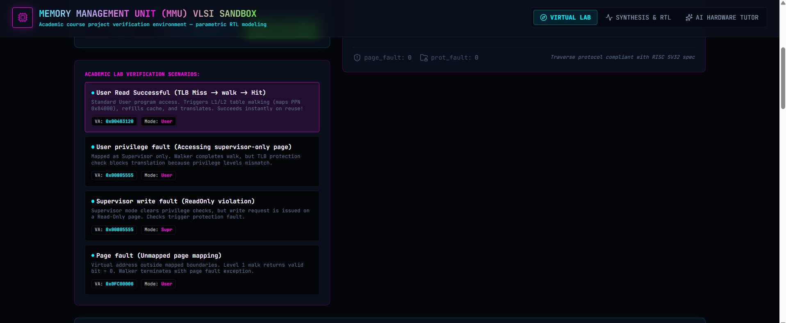
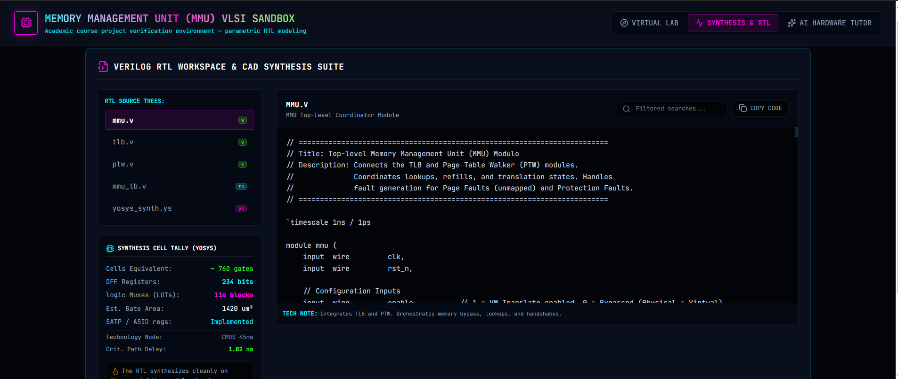
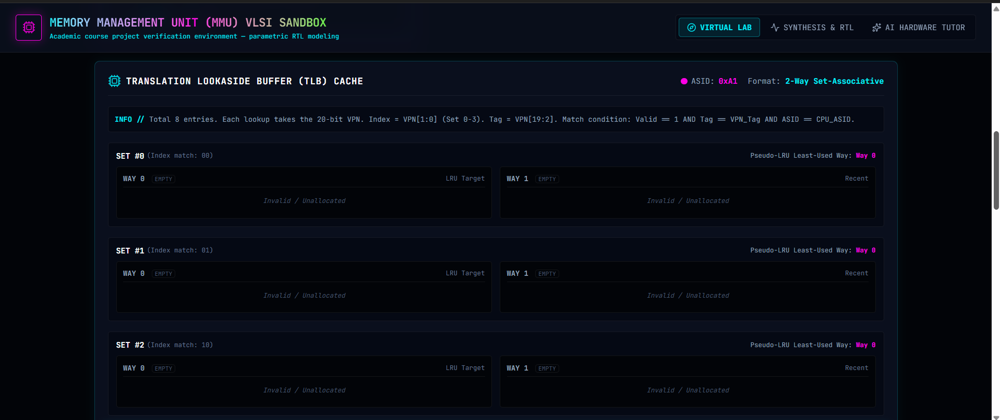
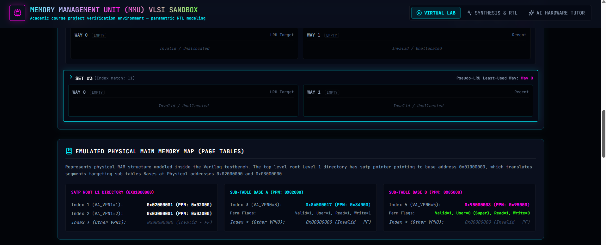
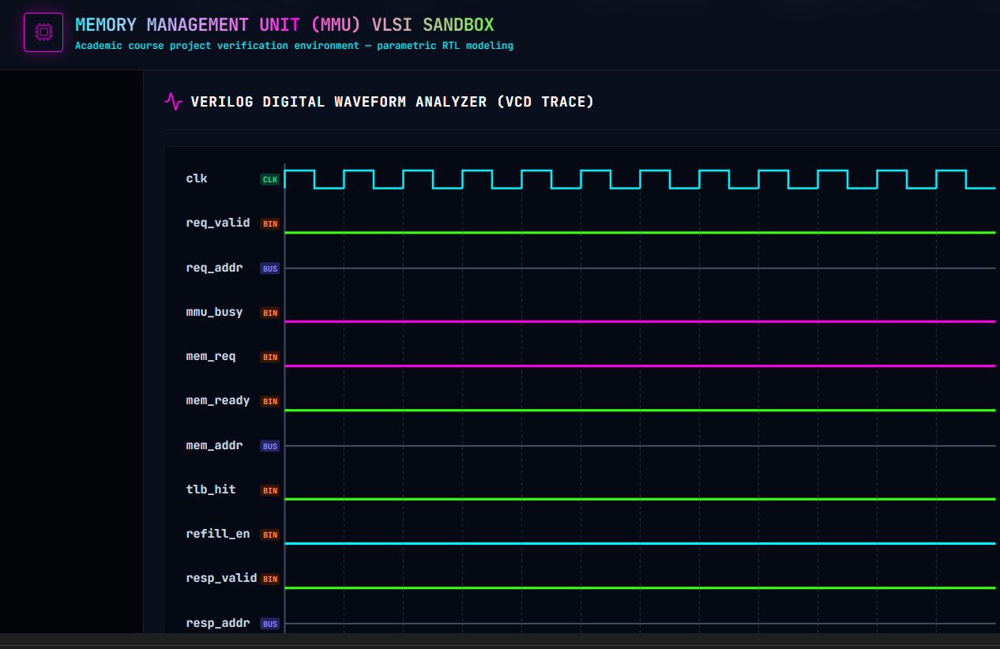
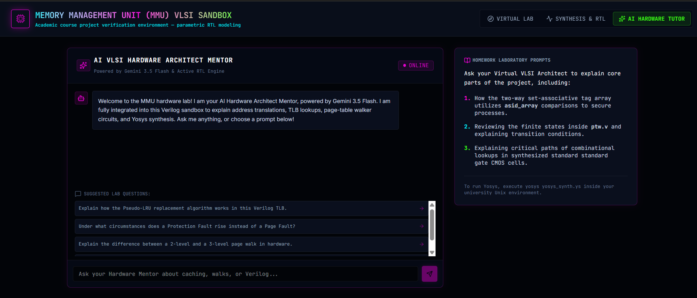

# 🌌 MMU Virtual Verification Sandbox




A full-stack, cycle-accurate hardware verification laboratory for a Memory Management Unit (MMU), designed in synthesizable Verilog HDL. This project bridges strict VLSI hardware design with a custom, Synthwave Dark-Aesthetic CAD sandbox built in React, TypeScript, and Tailwind CSS.

---

## 📑 Table of Contents
1. [Project Overview](#-project-overview)
2. [Hardware Modules (RTL)](#-hardware-modules-rtl)
3. [Virtual Laboratory Features](#-virtual-laboratory-features)
4. [Getting Started](#-getting-started)
5. [Author](#-author)

---

## 🔭 Project Overview

This interactive virtual laboratory runs cycle-accurate simulations in real-time. It allows users to visually track logic waveforms, explore Page Table Walker (PTW) memory mappings, and analyze TLB cache hits/faults through a dynamic, responsive UI. 

Additionally, the environment features a fully integrated server-side AI Mentor (powered by Gemini 3.5 Flash) acting as a VLSI Design Coach to guide users through complex architectural trade-offs and standard cell library mappings.

### 🧪 Pre-Loaded Verification Scenarios
The lab includes 4 target verification scenarios to safely replicate hardware faults visually:

1. **Standard User Read:** Demonstrates a TLB cache miss, L1/L2 table walking, cache allocation, and subsequent hits.
2. **Privilege Fault:** Simulates a User-space process illegally attempting to read a Supervisor-only page.
3. **Supervisor Write Fault:** Simulates write permission enforcement on Read-Only pages.
4. **Page Fault:** Simulates requests to unmapped virtual boundaries, triggering an invalid walk completion.

---

## 🛠️ Hardware Modules (RTL)

The core logic is written in strict, synthesizable Verilog HDL.



* **`tlb.v` (Translation Lookaside Buffer):** A parameterizable, 2-way set-associative cache. Features tag arrays, valid flags, ASID bounds checking, and a fully synthesizable Pseudo-LRU replacement algorithm.
* **`ptw.v` (Page Table Walker):** An asynchronous, 2-level SV32 hardware state-machine walking pages from L1 root tables (SATP) to L2 leaf tables to produce physical page numbers (PPN).
* **`mmu.v` (Top-Level Interconnect):** The root controller routing requests, enforcing privilege parameters, and signaling faults.
* **`mmu_tb.v` & `yosys_synth.ys`:** A robust test suite accompanied by CMOS 45nm standard library Yosys synthesis scripts to output cell-equivalent counts.

---

## 💻 Virtual Laboratory Features

### Translation Lookaside Buffer (TLB) Cache Tracker

Monitor active tags, pseudo-LRU replacement targets, and valid bits in real-time as virtual addresses are processed.

### Emulated Physical Memory Map

Explore the physical RAM structure modeled inside the Verilog testbench, tracking SATP pointers to L1 and L2 sub-tables.

### Vector Digital Waveform Analyzer

A dynamic SVG waveform analyzer tracking clock cycle states (`clk`) and outputting digital logic high/low lines (`valid`, `hit`, `miss`, `page_fault`) perfectly synced to the active simulation.

### AI VLSI Hardware Mentor

Connects the frontend to an Express-proxied server route querying Gemini 3.5 Flash. Tailored to act as a university VLSI Design Coach to help understand critical paths, combinational lookups, and hardware gate logic.

---

## 🚀 Getting Started

**Prerequisites:** Node.js (v16.x or higher) and Git.

1. **Clone the repository:**
   ```bash
   git clone [https://github.com/Jui-Ramteke/MMU-Virtual-Verification-Sandbox.git](https://github.com/Jui-Ramteke/MMU-Virtual-Verification-Sandbox.git)

2. **Navigate to the project directory:**
   ```bash
   cd MMU-Virtual-Verification-Sandbox

3. **Install dependencies:**
   ```bash
   npm install

4. **Run the development server:**
   ```bash
   npm run dev

5. **Open your browser:**
   ```
   Navigate to http://localhost:5173 to access the Sandbox.

---

# 👩‍💻 Author

### Jui Ramteke

Linkedin:

https://www.linkedin.com/in/jui-ramteke/


Instagram:

https://www.instagram.com/jui_ramteke_/


---

## ⭐ If you found this project useful, please give it a star on GitHub.
